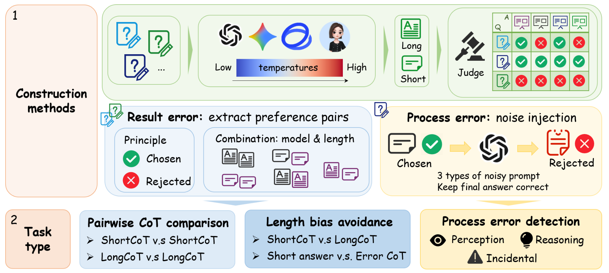

## M_Judger
Codes and Data for Reproducing: [Advancing Multimodal Judge Models through a Capability-Oriented Benchmark and MCTS-Driven Data Generation](https://arxiv.org/abs/2603.00546)

### Overview
The data construction methods and resulting task types in M-JudgeBench: Result-error pairs are derived from rollouts of different models with varied temperatures and reasoning lengths, while process-error data are produced by controlled noise injection preserving correct answers.

### Citation
Chen, Z., Yao, H., Zhao, Z., & Yang, M. (2026). Advancing Multimodal Judge Models through a Capability-Oriented Benchmark and MCTS-Driven Data Generation. arXiv preprint arXiv:2603.00546.
